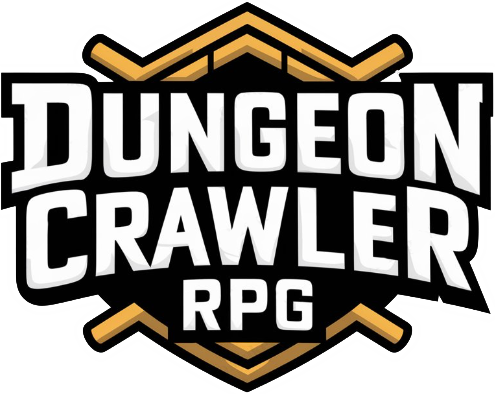
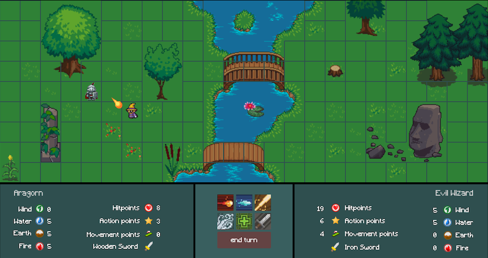

  

# Dungeon Crawler RPG

**Dungeon Crawler RPG** is a Java-based 2D dungeon crawler inspired by classic Dungeon Crawl roguelikes and the tactical, turn-based combat of Dofus.

---

## Features

- **Tile-based 2D dungeon** exploration on a grid
- **Turn-based combat** with enemy AI using A* algorithm for efficient tile-based pathfinding
- **Multiple spells and attack types** with elemental affinities (fire, water, earth, air, etc.)
- **Procedurally scaling levels**: enemy difficulty increases indefinitely after each level
- **Account creation & login** system for saving and loading player profiles

---

## Requirements

- **Java JDK 21** or newer
- **Maven 3.6+**
- **JavaFX 22**
- **SQLite JDBC 3.46**
- **JUnit 4.11** / **JUnit Jupiter 5.8.1** for testing

---

## Installation & Running

1. **Build the project**

   `mvn clean package`

2. **Run via Maven**

   `mvn javafx:run`

---

## Preview

  

